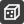
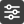

# Setting up the scene

 Models

Import CAD models, create primitives and control how models are displayed.

[Learn more about models](models.md)

 Measurement domain and interpolation

Set up the measurement domain and control how ProCap reconstructs a continuous flow field from measured points.

[Learn more about the measurement domain and interpolation](measurement-domain-and-interpolation.md)

 Probe settings

Select and configure the probe used in your project.

[Learn more about probe settings](probe-settings.md)

